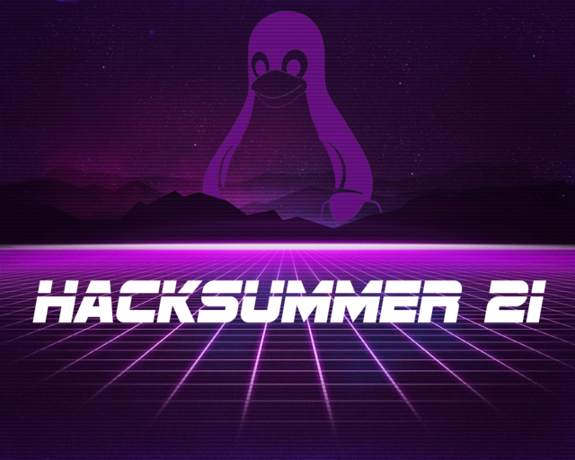

# HackSummer 21 Curriculum

## Overview

Welcome to the second year of #HackSummer! Just like the first iteration, the objective of HackSummer is provide free, interactive technology training for all curious minds. In 2020, we focused on the Python programming language. This year, we'll be putting on our sysadmin hats and diving into the Linux operating system. That might sound boring, but Linux is a powerful tool. Once mastered, it can become anything you want it to be. A hacker's weapon of choice? Sure. The basis of the next killer app? Absolutely. Even...

The brain of a helicopter on Mars.

To master Linux is to understand fundamental concepts about how computers and networks operate. Investing the time in learning how to set it up and manage it sets you miles ahead of the average technologist.

## Schedule/Viewing

This course will be presented as a streamed course. Livestreamed sessions will occur weekly, starting on **Wednesday, July 7, 2021**, until **Wednesday, August 11 2021**. Weekday streams will be at **5 PM Pacific**. All sessions will be live on [Twitch](https://twitch.tv/mttaggart), and will be recorded for later viewing on [YouTube](https://youtube.com/taggarttech).

## Discord

Ongoing chat on the [Discord](https://discord.gg/yQef982H). Come join us!

## Course Prerequisites

Having used a computer before will be helpful, but there are no formal prerequisites for this course. 

## Syllabus

The entire course syllabus can be viewed [here](syllabus.md)

## Materials

### Required

1. A hunger for learning!
2. A reasonably modern computer. Doesn't have to be a beast, but at least 8 GB of RAM.
3. An internet connection.
4. [VirtualBox](https://www.virtualbox.org/)
5. Time to commit to viewing the lectures and attempting the challenges 

## Learning Objectives

### Understandings

By the end of this course, you will understand:

* What Linux is
* How Unix-like operating systems differ from other OSes
* Linux file representations
* Linux file permissions
* Basic networking
* Shell scripting
* Client/server architecture
* Linux security concepts

### Skills

By the end of this course, you will be able to:

* Navigate the Linux filesystem
* Use built-in commands to manipulate Linux via the command line
* Install and configure new services
* Connect to other remote systems to perform administrative tasks
* Write scripts to automate tasks
* Secure systems against common vulnerabilities

## Course Structure:

HackSummer 21 is arranged like a fairly traditional course, except streamed over Twitch and YouTube. Each day, we'll begin by reviewing the challenges from the previous lesson, going over any questions asked either in live chat or the Discord. Then, we'll cover new material with examples and demonstrations to prepare you for the next set of challenges.

## Challenge VM

The Challenge VM is aligned with the material covered during the streams. The VM has several users, each with a separate password. Completing the quiz/challenge for each user unlocks the password for the next. 

To build it, you'll start from an Ubuntu 20.04 Virtualbox, which we'll build together during the first session. Then, you install the files from [this repository](https://github.com/mttaggart/hs21-files). 

Once the files are downloaded, run the following commands:

1. `cd hs21-files`
2. `sudo ./setup.sh`

The password for the starting challenge user is `HS21{lets_begin}`. The rest of the passwords are unique to each instance, as they are generated during install.

### Quizzes

Quizzes are simple knowledge checks to make sure you're absorbing the material. They often have simple answers or only require single commands to be run. A 100% on the quiz will unlock the next user password. Wrong answers will generate feedback to help answer the questions. Don't hesitate to ask for help on the Discord! We won't give answers, but there will always be help available.

### Challenges

Challenges involve practical applications of the knowledge covered during the streams. The objective will be to change the state of the VM in some way, whether modifying a config file, installing a package, or some combination of operations to achieve the objective. The challenge user will have a `README.txt` with instructions, and a `test` executable in the user home directory that will check for expected state, or other specific instructions as needed. If the state fails, feedback will be provided to help progress. If the tests pass, the next user password will be provided.
